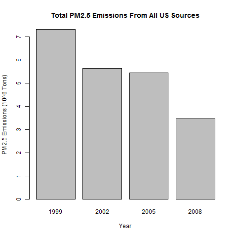
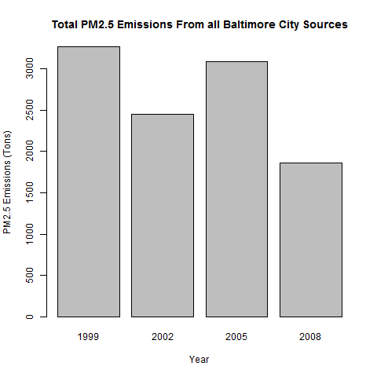
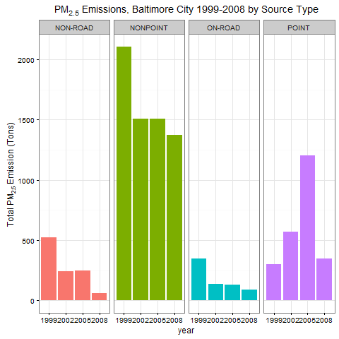
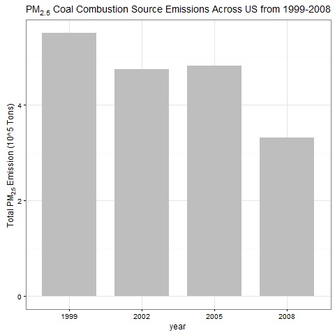
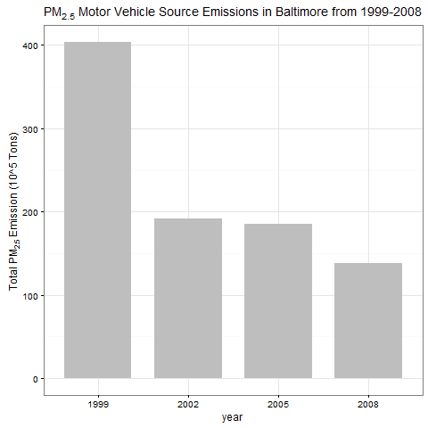
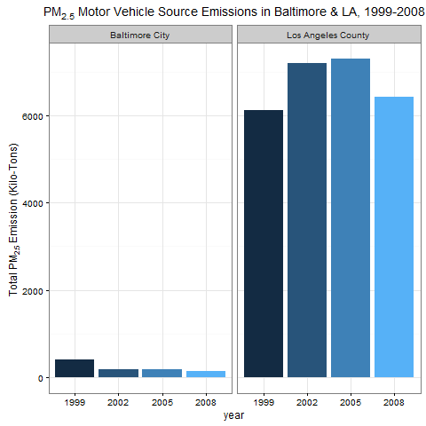

### Question 1

**Have total emissions from PM2.5 decreased in the United States from 1999 to 2008? Using the base plotting system, make a plot showing the total PM2.5 emission from all sources for each of the years 1999, 2002, 2005, and 2008.**

Calculate the aggregate of total PM2.5 emission from all sources for each of the years 1999, 2002, 2005, and 2008.


```r
aggTotals <- aggregate(Emissions ~ year,NEI, sum)
```

Using the base plotting system, make a plot showing the total PM2.5 emission from all sources for each of the years 1999, 2002, 2005, and 2008,


```r
barplot(
  (aggTotals$Emissions)/10^6,
  names.arg=aggTotals$year,
  xlab="Year",
  ylab="PM2.5 Emissions (10^6 Tons)",
  main="Total PM2.5 Emissions From All US Sources"
)
```

 

It is evident from the plot that the total emissions have decreased in the US from 1999 to 2008.

### Question 2

**Have total emissions from PM2.5 decreased in the Baltimore City, Maryland (fips == "24510") from 1999 to 2008?**

Calculate the aggregate of total emissions from PM2.5 for Baltimore City, Maryland (fips="24510") from 1999 to 2008.


```r
baltimoreNEI <- NEI[NEI$fips=="24510",]
aggTotalsBaltimore <- aggregate(Emissions ~ year, baltimoreNEI,sum)
```

Base plot of this data,


```r
barplot(
  aggTotalsBaltimore$Emissions,
  names.arg=aggTotalsBaltimore$year,
  xlab="Year",
  ylab="PM2.5 Emissions (Tons)",
  main="Total PM2.5 Emissions From All Baltimore City Sources"
)
```

 


Total emissions of PM2.5 have decreased in Baltimore City, Maryland from 1999 to 2008.

### Question 3

**Of the four types of sources indicated by the type (point, nonpoint, onroad, nonroad) variable, which of these four sources have seen decreases in emissions from 1999–2008 for Baltimore City?**

**Which have seen increases in emissions from 1999–2008?**

```r
library(ggplot2)

ggp <- ggplot(baltimoreNEI,aes(factor(year),Emissions,fill=type)) +
  geom_bar(stat="identity") +
  theme_bw() + guides(fill=FALSE)+
  facet_grid(.~type,scales = "free",space="free") + 
  labs(x="year", y=expression("Total PM"[2.5]*" Emission (Tons)")) + 
  labs(title=expression("PM"[2.5]*" Emissions, Baltimore City 1999-2008 by Source Type"))

print(ggp)
```

 


There has been a slight increase in "point" overall from 1999-2008. Also note that the `point` source saw a significant increase until 2005 at which point it decreases again by 2008 to just above the starting values. 
The `non-road`, `nonpoint`, `on-road` source types have decreased emissions overall from 1999-2008 in Baltimore City.


### Question 4

**Across the United States, how have emissions from coal combustion-related sources changed from 1999–2008?**

First we subset coal combustion source factors NEI data.


```r
# Subset coal combustion related NEI data
combustionRelated <- grepl("comb", SCC$SCC.Level.One, ignore.case=TRUE)
coalRelated <- grepl("coal", SCC$SCC.Level.Four, ignore.case=TRUE) 
coalCombustion <- (combustionRelated & coalRelated)
combustionSCC <- SCC[coalCombustion,]$SCC
combustionNEI <- NEI[NEI$SCC %in% combustionSCC,]
```

Note:  The SCC levels go from generic to specific. We assume that coal combustion related SCC records are those where SCC.Level.One contains the substring 'comb' and SCC.Level.Four contains the substring 'coal'.


```r
library(ggplot2)

ggp <- ggplot(combustionNEI,aes(factor(year),Emissions/10^5)) +
  geom_bar(stat="identity",fill="grey",width=0.75) +
  theme_bw() +  guides(fill=FALSE) +
  labs(x="year", y=expression("Total PM"[2.5]*" Emission (10^5 Tons)")) + 
  labs(title=expression("PM"[2.5]*" Coal Combustion Source Emissions Across US from 1999-2008"))

print(ggp)
```

 


Emissions from coal combustion related sources have decreased by about 1/3 from 1999-2008.

### Question 5

**How have emissions from motor vehicle sources changed from 1999–2008 in Baltimore City?**

First we subset the motor vehicles, which we assume is anything like Motor Vehicle in SCC.


```r
vehicles <- grepl("vehicle", SCC$SCC.Level.Two, ignore.case=TRUE)
vehiclesSCC <- SCC[vehicles,]$SCC
vehiclesNEI <- NEI[NEI$SCC %in% vehiclesSCC,]
```

Next we subset for motor vehicles in Baltimore,


```r
baltimoreVehiclesNEI <- vehiclesNEI[vehiclesNEI$fips==24510,]
```

Plot using ggplot2,


```r
library(ggplot2)
ggp <- ggplot(baltimoreVehiclesNEI,aes(factor(year),Emissions)) +
  geom_bar(stat="identity",fill="grey",width=0.75) +
  theme_bw() +  guides(fill=FALSE) +
  labs(x="year", y=expression("Total PM"[2.5]*" Emission (10^5 Tons)")) + 
  labs(title=expression("PM"[2.5]*" Motor Vehicle Source Emissions in Baltimore from 1999-2008"))

print(ggp)
```

 

Emissions from motor vehicle sources have dropped from 1999-2008 in Baltimore City.

### Question 6

**Comparing emissions from motor vehicle sources in Baltimore City (fips == "24510") with emissions from motor vehicle sources in Los Angeles County, California (fips == "06037"),**
**Which city has seen greater changes over time in motor vehicle emissions?**


```r
vehiclesBaltimoreNEI <- vehiclesNEI[vehiclesNEI$fips == 24510,]
vehiclesBaltimoreNEI$city <- "Baltimore City"
vehiclesLANEI <- vehiclesNEI[vehiclesNEI$fips=="06037",]
vehiclesLANEI$city <- "Los Angeles County"
bothNEI <- rbind(vehiclesBaltimoreNEI,vehiclesLANEI)
```

Create a plot using the ggplot2 system,


```r
library(ggplot2)
 
ggp <- ggplot(bothNEI, aes(x=factor(year), y=Emissions, fill=city)) +
 geom_bar(aes(fill=year),stat="identity") +
 facet_grid(scales="free", space="free", .~city) +
 guides(fill=FALSE) + theme_bw() +
 labs(x="year", y=expression("Total PM"[2.5]*" Emission (Kilo-Tons)")) + 
 labs(title=expression("PM"[2.5]*" Motor Vehicle Source Emissions in Baltimore & LA, 1999-2008"))
 
print(ggp)
```

 

Los Angeles County has seen the greatest changes over time in motor vehicle emissions.